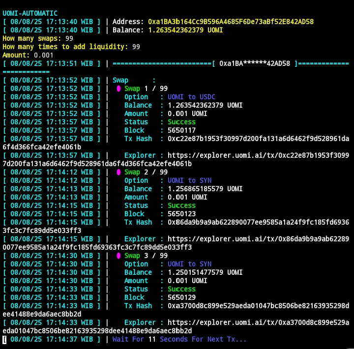

# UOMI-AUTOMATIC

`UOMI-AUTOMATIC` is a Python script designed to automate interactions on the Uomi testnet. This script allows you to easily perform token swaps and add liquidity to pools in bulk, with a simple and quick configuration.

## Key Features
* **Automated Swaps**: Performs random token swaps from UOMI to USDC, SYN, or SIM.
* **Automated Liquidity Provision**: Adds liquidity to various supported token pools.
* **Practical Configuration**: Retrieves private keys from a `.env` file and a list of proxies from `proxies.txt`.
* **Simple Interface**: After running the script, you only need to input the number of swaps, number of liquidity additions, and the token amount.
* **Transaction Log**: Displays the status, transaction hash, and explorer link for every successful transaction.


To run this script, you need to install several Python libraries.

1.  **clone this repository**
    Open your terminal or Command Prompt and run the following command:
    ```bash
    git clone https://github.com/Chimalai/U0M1-AUTOMATIC.git
    cd U0M1-AUTOMATIC
    ```

## Install Required Libraries
### For macOS and Linux
1.  Create a virtual environment:
    ```bash
    python3 -m venv myvenv
    ```
2.  Activate the virtual environment:
    ```bash
    source myvenv/bin/activate
    ```

### For Windows (Command Prompt)
1.  Create a virtual environment:
    ```bash
    python -m venv myvenv
    ```
2.  Activate the virtual environment:
    ```bash
    myvenv\Scripts\activate
    ```

### For Windows (PowerShell)
1.  Create a virtual environment:
    ```bash
    python -m venv myvenv
    ```
2.  Activate the virtual environment:
    ```bash
    .\myvenv\Scripts\activate
    ```
3.  Install libraries:
    ```bash
    pip install web3 aiohttp aiohttp-socks colorama pytz python-dotenv
    ```

## Prepare Configuration Files
Make sure you have the following files in the same folder as the `main.py` script:
* `main.py`: The main script for the bot.
* `.env`: This file stores your account private keys. Use a format like this:
    ```
    PRIVATE_KEY_1=your_private_key_1
    PRIVATE_KEY_2=your_private_key_2
    # ... and add more if you want
    ```
* `proxies.txt`: (Optional) This file contains your list of proxies, one proxy per line.

## How to Use
1.  Open your terminal in the script directory.
2.  Run the script with the following command:
    ```bash
    python main.py
    ```

## Developer
* **Developer**: PetrukStar
* ** buy me a coffe ☕**
    ```bash
    0x6b09F6E036E83a7F12530Ea96aC25e73090DFF8C
    ```
